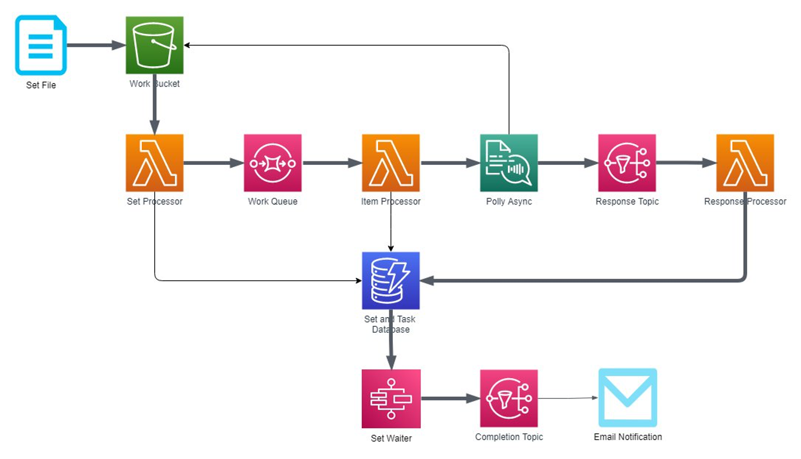

# Amazon Polly Asynchronous Batch

Run large numbers of voice synthesis tasks through Amazon Polly asynchronously.



This project contains source code and supporting files for a serverless application that you
deploy into your own AWS account. It includes the following files and folders:

 * `amazon_polly_async_batch` - python code for Lambda functions
 * `docs` - Documentation 
 * `docs/samples` - Books from the public domain to test the application

To use the solution, you write a _set file_ containing the text you want
turned into sound files. You upload this file to a specific S3 bucket
in your account, and are then notified when Amazon Polly is done synthesizing all of
them.

## Deployment

Use AWS Server Application Model (SAM) to deploy the solution stack.

### Preconditions

To deploy this stack you need:

 1. [AWS Command Line Interface](https://docs.aws.amazon.com/cli/latest/userguide/install-cliv2.html)
 2. [AWS SAM CLI](https://docs.aws.amazon.com/serverless-application-model/latest/developerguide/serverless-sam-cli-install-linux.html)
 3. [Python 3.7](https://www.python.org/downloads/)

If you do not already have a development environment set up with these
components, consider [AWS CloudShell](https://aws.amazon.com/cloudshell/).

### Deploying the Stack

Then make a local copy of this project's source code, then use SAM to build a
CloudFormation template:

```bash
$ git clone https://github.com/aws-samples/amazon-polly-async-batch.git
$ cd amazon-polly-async-batch
$ sam build
```

To deploy the service, issue the `deploy` command:

```bash
$ sam deploy --stack-name amazon-polly-async-batch --guided
```

When prompted, specify the preferred region, notification email, and so on:

```bash
Configuring SAM deploy
======================

        Looking for config file [samconfig.toml] :  Not found

        Setting default arguments for 'sam deploy'
        =========================================
        Stack Name [amazon-polly-async-batch]: 
        AWS Region [us-east-1]: 
        Parameter Notifyemail []: *[YOUR EMAIL ADDRESS]*
        #Shows you resources changes to be deployed and require a 'Y' to initiate deploy
        Confirm changes before deploy [y/N]: N
        #SAM needs permission to be able to create roles to connect to the resources in your template
        Allow SAM CLI IAM role creation [Y/n]: Y
        Save arguments to configuration file [Y/n]: Y
        SAM configuration file [samconfig.toml]: 
        SAM configuration environment [default]: 
...
```

Initial deployment can take a few minutes. 

## Operation

Create a set file in YAML describing the text you want Amazon Polly to voice, including optional
filenames for the sound files. Upload this file to the S3 bucket watched by the application.

The [docs/samples](docs/samples) folder contains a number of sample files to try.

For example, to synthesize the novel _Moby Dick_ paragraph by paragraph, 
issue this copy command:

```bash
$ aws s3 cp docs/samples/moby-dick.yml s3:\\*[YOUR BUCKET]*
```

Audio files will be placed in `s3:\\[YOUR WORK BUCKET]\moby-dick` as Amazon Polly completes them. Once all the
paragraphs have been voiced, you will receive email notification.

## Cleanup

When not in use, the only charge for using the solution is the storage costs for the 
files in the S3 bucket, and for records left in DynamoDB.

To delete the solution, delete any configuration or sound files from the main bucket, then use 
CloudFormation to delete the stack. 

```bash
$ aws cloudformation delete-stack --stack-name amazon-polly-async-batch
```

## Security

See [CONTRIBUTING](CONTRIBUTING.md#security-issue-notifications) for more information.

## License

This library is licensed under the MIT-0 License. See the LICENSE file.
